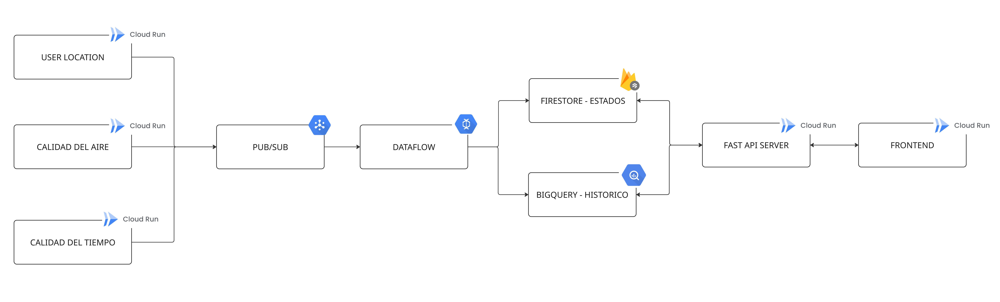

# CloudRISK — Serverless Urban Conquest

**Camina Valencia. Cada paso es munición. Conquista los 87 barrios.**

Proyecto 100 % **serverless** sobre Google Cloud Platform. Juego de estrategia geolocalizado tipo *Risk* sobre Valencia, construido como pipeline de datos **100 % serverless** en GCP.

## Índice
  - 1) Qué es CloudRISK
  - 2) Arquitectura
  - 3) Reglas del juego
  - 4) Flujo de datos
  - 5) Estructura de tablas - Firestores & BigQuery
  - 6) Arranque rápido en local
  - 7) Despliegue a GCP
  - 8) Resultados, aprendizajes y mejoras

Terminar una vez tengamos todas las secciones OK. 

---

## 1. Qué es CloudRISK

Los ejércitos y el oro de cada jugador **no se regalan**: salen de los pasos
que da en la vida real. Un pipeline streaming los valida (anti-trampa + caps),
los convierte en tropas y los escribe en Firestore; desde ahí el jugador los
despliega en el mapa.

Objetivo educativo: aplicar Pub/Sub, Dataflow stateful, Firestore, BigQuery,
Cloud Run y Terraform sobre un caso de uso real, sin un solo servidor encendido
permanentemente (salvo el job de Dataflow, que por diseño mantiene estado).

---

## 2. Arquitectura

La arquitectura seleccionada para la resolución del reto es la siguiente: 



Como vemos, se trata de una arquitectura que respeta la filosofía habitual de proyectos de big data : ingesta - transformación - almacenamiento - visualización. 

En nuestro caso, tenemos una ingesta de datos de geolocalización de usuarios, factor de calidad ambiental y calidad del aire. Estos datos entran a dataflow donde se aplica la lógica de negocio y como resultado se insertan los ejercitos equivalentes ganados por el usuario tanto en firestore como en BigQuery. 

Firestore alberga las tablas de estados, en el tenemos la tabla de user_balance y location_balance, que se actualizan conforme avanza la partida con los ejercitos disponibles por usuario y las zonas del mapa con los ejercitos y usuario que las controla. 

La base de datos de BigQuery nos sirve para almacenar datos históricos para métricas y analisis más profundos. 

Por último, el frontend se conecta a la tablas mediante un servidor de FastAPI que sirve como puerta de acceso a las bases de datos. Además, las acciones de los usuarios que puedan hacer en la aplicación también interactuan con las bases de datos mediante este servidor de entrada. 

---

## 3. Reglas del juego

Explicar las reglas del juego, lógica que aplica dataflow de los multiplicadores etc. 

---

## 4. Flujo de datos

Explicamos como funcionan los dos flujos de datos 
- Flujo 1: pasos y multiplicadores + pipeline dataflow + inserts a las tablas
- Flujo 2: Como el usuario selecciona ejercitos y los mete en las tablas

---

## 5. Estructura de tablas - Firestores & BigQuery

Explicar las 4 tablas, para que sirve cada una, estructura de datos. Por que escojemos firestore y bigquery

---

## 6. Arranque en local
El arranque local supone levantar la arquitectura mediante contenedores de docker locales y scripts de python en nuestro propio ordenador. Para ello usamos imagenes oficiales de Pub/Sub y Firestore para simular en local esos servicios de GCP. Mediante el despliegue en local somos capaces de testear la arquitectura y desarrollar el proyecto de forma cómoda y sin levantar recursos reales en el proyecto de GCP que suponen un coste. La estructura del repositorio está diseñada para poder levantarse en local o en nube indistintamente. 

Pasos para arrancar la arquitectura en local: 

**Terminal 1 — Docker**

Levantamos los contenedores de Pub/Sub, IFrestore, APIS y fronted: 
```bash
docker compose up -d --build
```
**Terminal 2 — Crear topics en el emulador (una sola vez)**

El contendor de Pub/Sub está vacío, tenemos que crear los tópicos y suscripciones de manera manual: 
```bash
export PUBSUB_EMULATOR_HOST="localhost:8085"
pip install google-cloud-pubsub
python scripts/setup_local_pubsub.py
```
**Terminal 3 — Pipeline Apache Beam (queda corriendo)**

Apache BEAM es un script que se ejecuta en nuestro ordenador (el pipeline), tenemos que levantarlo a mano: 
```bash
export PUBSUB_EMULATOR_HOST="localhost:8085"
export FIRESTORE_EMULATOR_HOST="localhost:8200"
pip install -r pipelines/requirements.txt
python pipelines/cloudrisk_unified.py `
    --runner=DirectRunner `
    --project=cloudrisk-local `
    --player_sub=projects/cloudrisk-local/subscriptions/player-movements-sub `
    --weather_sub=projects/cloudrisk-local/subscriptions/weather-sub `
    --airq_sub=projects/cloudrisk-local/subscriptions/air-quality-sub `
    --local --streaming
```
**Terminal 4 — Walker / simulador de pasos (genera datos)**

Ejecutamos el generador de pasos: 
```bash
export PUBSUB_EMULATOR_HOST="localhost:8085"
export PUBSUB_PROJECT="cloudrisk-local"
pip install -r data_generator/requirements.txt
python data_generator/juego_caminante.py --moves 50 --pause 0.5
```
---

## 7. Despliegue a GCP

### ¿Es esto 100 % serverless como pide Javier?

Sí — el stack está alineado con el repo de referencia de clase ([jabrio/Serverless_EDEM_2026](https://github.com/jabrio/Serverless_EDEM_2026)). Nada de Compute Engine, ni GKE, ni VMs que tengamos que mantener nosotros. Los servicios son todos gestionados por Google: Cloud Run, Dataflow, Pub/Sub, Firestore, BigQuery, Cloud Scheduler, Secret Manager, Artifact Registry, Cloud Storage.

Hay dos matices técnicos que conviene dejar por escrito para que no parezcan descuidos:

1. **`air-ingestor` y `weather-ingestor` tienen `min_instance_count = 1`** ([08_cloud_run.tf](infrastructure/terraform/08_cloud_run.tf)). Cloud Run "puro" escala a cero, pero estos dos servicios hacen polling cada 30s a OpenWeather — si escalaran a cero dejarían de pollear. Siguen siendo serverless (pagamos por uso, no gestionamos la VM), pero con 1 instancia tibia permanente.
2. **Dataflow streaming mantiene workers 24/7** ([12_dataflow.tf](infrastructure/terraform/12_dataflow.tf)). Un job streaming por definición no escala a cero: los workers los gestiona Google con autoscaling de 1 a 3, pero siempre hay al menos 1. Es el mismo patrón que el `realtime_recommendation_engine` del repo del profe.

Los demás servicios (`cloudrisk-api`, `cloudrisk-web`, `walker`, `steps-fetcher`) sí escalan a cero cuando nadie los usa.

La consigna del profe es literal: *"The infrastructure must be managed as a Terraform project, allowing the entire architecture to be deployed seamlessly with a single terraform apply command"*. Eso es lo que hemos montado — el apartado 7.3 de abajo.

---

### Cómo se despliega

Todo el despliegue va con Terraform. La idea es: `terraform init`, `terraform plan`, `terraform apply` y ya. No hay pasos "manuales" raros en medio — los builds de Docker y el flex template de Dataflow los dispara el propio Terraform (los metí dentro de `null_resource` en [infrastructure/terraform/13_docker_builds.tf](infrastructure/terraform/13_docker_builds.tf)).

Lo único que Terraform NO puede hacer por sí solo es lo previo: loguearte en GCP, crear el bucket donde vive su propio state, y autenticar Docker contra Artifact Registry. Eso lo hace `infrastructure/deploy.sh` en 4 comandos — una sola vez por ordenador.

Antes de empezar hace falta tener `gcloud`, `docker` y `terraform` instalados. Y Docker corriendo (Docker Desktop abierto en Mac/Windows).

### 7.1 — Bootstrap (solo una vez por máquina)

Este script hace lo que Terraform no puede hacer por sí mismo: login, bucket de state, auth de Docker. Detalle de qué hace por dentro al final de esta sección.

```
bash infrastructure/deploy.sh cloudrisk-492619
```

### 7.2 — Rellenar `terraform.tfvars`

Los secretos del proyecto (JWT para login y token del scheduler) los necesita Terraform pero NO queremos que se suban a GitHub. Por eso están en `terraform.tfvars`, que está gitignored.

Copia el ejemplo y genera los dos secretos:
```
cp infrastructure/terraform/terraform.tfvars.example infrastructure/terraform/terraform.tfvars
python -c "import secrets; print(secrets.token_hex(32))"
python -c "import secrets; print(secrets.token_hex(32))"
```

Los 2 valores que imprime los pegas en `terraform.tfvars` como `jwt_secret` y `scheduler_secret`.

### 7.3 — Terraform init / plan / apply

Desde la carpeta de Terraform:
```
cd infrastructure/terraform
terraform init
terraform plan
terraform apply
```

`terraform apply` tarda un rato (unos 15-20 min la primera vez) porque construye y sube las 6 imágenes Docker + el flex template de Dataflow + todos los recursos de GCP. Al final imprime las URLs públicas del backend y del frontend.

### 7.4 — Paso manual: key de OpenWeatherMap

Este es el único paso que no se puede automatizar. La key la da OpenWeatherMap después de registrarte en su web, así que hay que meterla a mano después del `terraform apply`. Mientras no lo hagas, los ingestors de aire y clima arrancan pero no traen datos reales.

```
echo -n 'TU_KEY_DE_OPENWEATHER' | gcloud secrets versions add openweather-api-key --data-file=-
```

Cloud Run la recoge automáticamente (lee `version = "latest"`).

### 7.5 — Probar el stack con `simulador_bots.py`

El mismo script sirve para validar el backend en los 4 escenarios que nos importan. Lo llamas igual en local y en cloud — cambia solo el flag `--url`. Si un stress test falla, sale con exit code 1 (útil para CI).

**Caso A — smoke test rápido en local (ASGI in-process, sin Docker):**
```
python backend/simulador_bots.py --speed fast --rounds 2
```
Registra 4 bots contra el backend FastAPI in-memory, corre las 4 estrategias concurrentes y los 3 stress tests (S1 race-to-conquer, S2 simultaneous-attacks, S3 unauthorized-resolve). Tarda ~1 min.

**Caso B — partida larga visual en local:**
```
python backend/simulador_bots.py --speed slow --rounds 10
```
Multiplica los sleeps por 20 — puedes seguir cada acción por terminal como si fuera una partida real. Útil para enseñar cómo se ven las rondas.

**Caso C — smoke test contra el Cloud Run desplegado:**
```
python backend/simulador_bots.py --url https://cloudrisk-api-xxx.run.app --speed fast --rounds 2
```
Los bots se registran con sufijo único (`_{timestamp}`) para no chocar con usuarios previos en Firestore. Si algo está roto en producción, el script lo detecta.

**Caso D — jugar tú desde el frontend contra UN solo bot:**
```
python backend/simulador_bots.py --url https://cloudrisk-api-xxx.run.app --single-bot INVASOR --rounds 30 --speed slow
```
Lanza un único bot (`CONQUISTADOR`, `INVASOR`, `CORREDOR` o `DEFENSOR`), sin stress tests. Abres el frontend, te registras con tu propio usuario, y ves al bot conquistar/atacar zonas en tiempo real. Es la forma más bonita de "demostrar que el stack entero funciona".

**Extra — CI automatizado (GitHub Actions):**

El workflow [`.github/workflows/smoke-test.yml`](.github/workflows/smoke-test.yml) corre el Caso C todos los lunes a las 06:00 UTC contra la URL guardada en el secret `CLOUDRISK_API_URL`. También se puede disparar a mano (`workflow_dispatch`) pegando la URL. Si el backend se cae entre demos, te enteras antes de entrar a clase.

Para activarlo:
```
# Settings > Secrets and variables > Actions > New repository secret
#   Name:  CLOUDRISK_API_URL
#   Value: https://cloudrisk-api-xxx.run.app
```

---

### ¿Qué hace `infrastructure/deploy.sh` por dentro?

Las 4 cosas que Terraform no puede hacer por sí mismo:
1. **`gcloud auth login`** + **`application-default login`** — te loguea en GCP (se abre el navegador).
2. **Crea el bucket GCS de tfstate** (`<project-id>-tfstate`) con versionado activado — es donde Terraform guarda su contabilidad. Si lo borras, Terraform se vuelve loco.
3. **Habilita las 2 APIs mínimas** (Artifact Registry + Cloud Resource Manager) — las demás las habilita Terraform en `01_apis.tf`.
4. **`gcloud auth configure-docker`** — para que `docker push` contra Artifact Registry funcione sin pedir password.

Si lo quieres cambiar o entender mejor está en [infrastructure/deploy.sh](infrastructure/deploy.sh) — son 40 líneas bien comentadas.

### Qué se despliega
- **Firestore** — base de datos del juego (zonas, jugadores, batallas), con PITR de 7 días
- **Pub/Sub** — 3 colas de mensajes (pasos, clima, aire) con sus DLQ
- **BigQuery** — dataset `cloudrisk` para la analítica
- **Cloud Run** — 4 servicios (api, web, air-ingestor, weather-ingestor) + 2 jobs (walker, steps-fetcher)
- **Dataflow** — el pipeline unificado que convierte pasos en ejércitos
- **Cloud Scheduler** — los crons diarios (decay, batallas, ingesta de pasos)

---

## 8. Resultados, aprendizajes y mejoras

### 8.1 — Auto-setup de partida al arrancar el backend

Antes, cada vez que un compañero clonaba el repo y levantaba el backend,
Firestore estaba vacío y el frontend mostraba 0 zonas. Ahora el arranque de
la API llama a `/setup/run` internamente — 15 zonas × 4 jugadores con
`defense_level=2` y pool vacío. Así el HUD del mapa ya pinta algo a la
primera, sin tocar ningún botón.

**Aprendizaje**: los defaults "cero" son hostiles para una demo. Si el
estado inicial del sistema no tiene sentido visual, el primero que abre la
app piensa que está roto.

### 8.2 — Bots que juegan "como un humano" (v3.3)

El bot original era tonto — elegía cualquier zona random, ignoraba si era
adyacente y no pagaba pool. Con 3 bots jugando simultáneamente el usuario
perdía la partida sin ver nada interesante.

Qué cambió en [simulador.py](backend/cloudrisk_api/endpoints/simulador.py):

- **Priorizan al líder**: `_get_leader()` devuelve el jugador con más
  zonas. El bot intenta atacarle primero — así la partida se autoequilibra
  en vez de ir todos contra el usuario.
- **Adyacencia real**: `neighbors_of(zone_id)` filtra sólo zonas tocables.
  Antes el bot "teletransportaba" tropas.
- **Pagan su pool igual que yo**: 2 `power_points` por conquista, 1 por
  fortificar, debitados vía `usuarios_repo.update_user`. Si el pool está a
  0, el bot hace `idle`.
- **Reciben `_grant_turn_bonus` al terminar su turno**: mismo bonus que el
  humano (`max(3, zones//3)`). Antes sólo se lo daba al usuario y los
  bots quedaban descapitalizados a los 2-3 turnos.
- **Atacar gasta defensa de la zona origen**: `defense_level -= 1` tras
  atacar. Evita que un bot con 1 zona potente conquiste media ciudad sin
  mermarse.

**Aprendizaje**: "bot inteligente" en un juego multijugador no es que juegue
bien — es que juegue creíble. Si el bot no sigue las mismas reglas que el
humano, la partida se siente rota aunque técnicamente funcione.

### 8.3 — `/simulate_bots/run` con `mode="step"`

El endpoint original ejecutaba los 3 turnos de bot en una sola llamada HTTP.
El `TurnBanner` del frontend no alcanzaba a pintar "Turno de Sur" antes de
que ya hubiera pasado al siguiente. Añadimos `mode: Literal["loop","step"]`
con default `"loop"` (retrocompat total) — en `step` el backend ejecuta UN
solo turno de bot y devuelve. El frontend controla la cadencia.

**Aprendizaje**: si quieres feedback visual en un proceso iterativo, el
servidor tiene que devolver control entre iteraciones. La alternativa (SSE,
websockets) era overkill para 3 turnos.

### 8.4 — Botón "Jugar turnos de bots" en el HUD del mapa

Estaba en el Dashboard (lobby), pero la partida pasa en el `MapView`. Lo
movimos al HUD, al lado de "Terminar turno". El componente `SimulateBotsButton`
tiene su propio polling de `/turn/` cada 3s (patrón ya usado por
`TurnBanner` y `EndTurnButton`) — no tocamos el prop drilling del padre.

**Aprendizaje**: 3 componentes polleando el mismo endpoint es "más feo" en
teoría pero mantiene los componentes independientes y el prop drilling
limpio. Elevar a un `useTurn()` compartido lo dejamos para cuando duela.

### 8.5 — Cadencia lenta (4.5s/paso) + resumen por bot

El botón recorre 3 bots con `await sleep(4500)` entre pasos — total ≈ 14s.
Durante la pausa el botón muestra `✓ Sur: +2 zonas, +1 fort (1/3)` —
resumen de lo que acaba de hacer ese bot. Al cambiar de bot pinta
`Jugando Este… (2/3)` y repite.

**Bug que aprendimos a no cometer**: la condición inicial era
`lastSummary.bot !== currentBot` — lo contrario de lo que queríamos. El
resumen se veía 500ms en la transición y la pausa de 4.5s mostraba
"Jugando X…" — totalmente inútil. Fix en [commit e0c5071](frontend/src/pages/UrbanPacer.jsx).

**Aprendizaje**: al escribir labels de UI con estados derivados, dibujar
el timeline en papel antes de codear. Los `!==` invertidos son el bug más
estúpido y más caro de diagnosticar en caliente.

### 8.6 — Modal de ataque con info real de la zona

El `ActionPanel` con `kind="attack"` mostraba 3 pills con el balance del
ATACANTE (`Disponibles/Hoy/Total`). Tras el auto-setup el pool está a 0 y
se veía `0/0/0` — parecía un bug de la zona objetivo. Sustituido por:

- **DEFENSA** — `zone.total_armies ?? zone.defense_level` en rojo.
- **PROPIETARIO** — nombre del clan rival con su color.
- **MIS ADY.** — conteo de mis zonas adyacentes con `defense_level >= 2`.
  Si es 0 → banner amarillo + botón disabled ("Conquista primero un
  barrio vecino").

**Aprendizaje**: un modal de acción debe mostrar info del objetivo, no del
actor. Y la validación debe ser pre-click (banner) además de post-click
(red de seguridad del backend) — si el usuario sólo se entera del error
tras pulsar, la UX se siente rota.

### 8.7 — Gotcha de Terraform: cambios en código Python no redeployan

[13_docker_builds.tf](infrastructure/terraform/13_docker_builds.tf) dispara
`docker build` con `triggers = { dockerfile, requirements }`. Si tocas
`simulador.py` o `UrbanPacer.jsx` y haces `terraform apply`, Terraform dice
`No changes` y Cloud Run sigue sirviendo la imagen vieja.

Para forzar rebuild tras cambios sólo de código:
```
cd infrastructure/terraform
terraform apply -replace=null_resource.image_api -replace=null_resource.image_frontend
```

**Aprendizaje**: `filemd5()` sobre Dockerfile/requirements es barato y
evita rebuilds innecesarios, pero introduce un paso manual cuando cambias
sólo código fuente. Alternativa futura: un trigger que haga hash recursivo
de `backend/**/*.py`, aunque relentiza cada `plan`.

### 8.8 — Flujo de trabajo: worktree + main local, sin push

Durante toda esta fase trabajamos sobre un worktree
(`.claude/worktrees/stoic-jepsen-070830`) con rama `claude/stoic-jepsen-070830`
y fusionamos a `main` local. No hacemos `git push` — el push lo hace el
usuario cuando quiere. Al fusionar `origin/main` en local (commit
`a4fe46d`) sin conflictos, confirmamos que el worktree no divergió.

**Aprendizaje**: worktrees separan el trabajo en curso de la rama principal
sin clonar el repo dos veces. Combinado con "commit local, push manual",
das margen al humano a revisar antes de publicar.

