# 📖 CloudRISK — Explicación del proyecto (para humanos)

> Guía visual de qué es el proyecto, qué hemos construido y por qué.
> Si es tu primer día, empieza por aquí antes de tocar código.

---

## 🎯 ¿Qué es CloudRISK?

**CloudRISK / WalkRisk** es un juego tipo *Risk* pero basado en el mundo real:

- 🚶 Caminas por Valencia (el móvil cuenta tus pasos).
- ⚔️ Cada paso tuyo se convierte en **1 ejército** dentro del juego.
- 🗺️ Con tus ejércitos, conquistas zonas del mapa de Valencia.
- 🌦️ El tiempo y la calidad del aire afectan a lo que pasa en cada zona.

Este repo es **la infraestructura en la nube** que hace que todo eso funcione. No es el juego en sí, es el "motor" detrás.

---

## 🧩 Las piezas del sistema

Imagina una **cadena de montaje** en una fábrica:

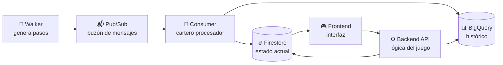

### 1. 🚶 Walker — el que genera los datos
- **Qué es:** un programa Python que simula un jugador caminando por Valencia.
- **Qué hace:** cada 1-2 segundos dice *"estoy en la esquina X, Y, a 1.4 m/s"*.
- **Dónde vive:** `data_generator/main.py`, dentro de un contenedor Docker.
- **Analogía:** el operario al principio de la cinta, metiendo piezas.

### 2. 📬 Pub/Sub — el buzón de correos
- **Qué es:** un servicio de Google Cloud que funciona como un buzón.
- **Qué hace:** recibe mensajes del walker y los guarda hasta que alguien los lea.
- **Por qué es útil:** separa **quien genera datos** de **quien los procesa**. Si el consumer se cae, los mensajes no se pierden, esperan en el buzón.
- **Topic que usamos:** `player-movements`.

### 3. 📮 Consumer — el cartero
- **Qué es:** otro programa Python en Docker.
- **Qué hace:** va al buzón, saca los mensajes uno por uno, los procesa, y los escribe en las bases de datos.
- **Dónde vive:** `consumer/main.py`.
- **Estado actual:** solo los imprime en pantalla. En Fase 4 escribirá en Firestore + BigQuery.

### 4. 🔥 Firestore — el "ahora"
- **Qué es:** base de datos NoSQL de Google.
- **Qué guarda:** el **estado actual** del juego. Como una foto instantánea.
- **Ejemplo:** `player_001` → `{armies: 47, updated_at: 2026-04-07}`.

### 5. 📊 BigQuery — el "diario"
- **Qué es:** almacén de datos analíticos de Google.
- **Qué guarda:** el **histórico completo**. Como un libro de actas.
- **Ejemplo:** los 10.000 pasos que ha dado `player_001` desde el principio del juego.
- **Para qué:** estadísticas, rankings, gráficos.

---

## 🔄 Los dos flujos del sistema

### Flujo 1 — Ingesta (el walker alimenta el sistema)

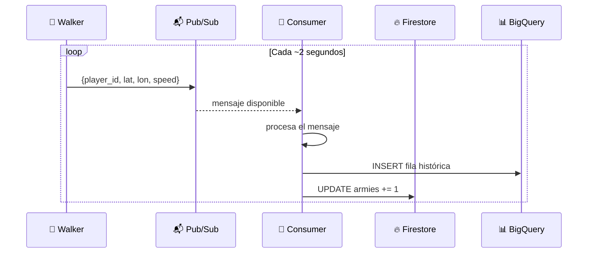

### Flujo 2 — Acciones del jugador (el frontend manda)

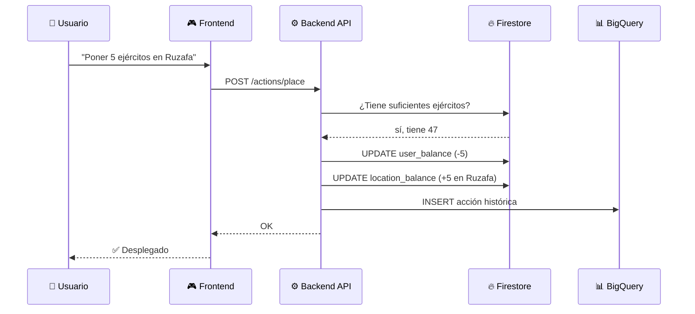

---

## 🛠 Lo que hemos construido hasta ahora

### Fase 0 — Arranque del proyecto
- Creación del repositorio `DATA-PROJECT-2-EDEM` con la estructura base de carpetas (`data_generator/`, `consumer/`, `backend/`, `frontend/`, `weather_airq/`, `docs/`, `CICD/`).
- Definición del esquema del juego (WalkRisk): jugadores, pasos, ejércitos, localizaciones.
- Redacción del `WALKRISK_SPEC.md` con la idea, las reglas y el reparto del equipo (yo / Álvaro / Ricardo).
- Referencias al repo del profesor (`Serverless_EDEM_2026`) y al ejemplo `ClickerGCP-main`.

### Fase 1 — Setup de Google Cloud
- Creación del proyecto GCP **`cloudrisk-492619`**.
- Activación de **billing** (facturación).
- Habilitación de las APIs necesarias: Pub/Sub, Firestore, BigQuery, Cloud Run, Cloud Build, Artifact Registry, IAM.
- Instalación de `gcloud CLI` en local y configuración del proyecto por defecto.
- Generación de las credenciales ADC en local con `gcloud auth application-default login`.
- Verificación con `gcloud auth list` y `gcloud projects describe cloudrisk-492619`.

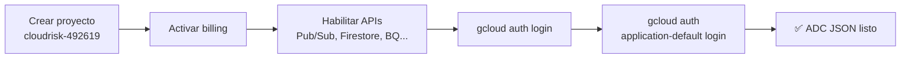

### Fase 2 — Infraestructura de datos en GCP
- Creación de los **topics de Pub/Sub**:
  - `player-movements` (walker → consumer)
  - `game-events` (auditoría)
  - `notifications`
- Creación de **Firestore Native** en región `eur3` (Europa).
- Creación del **dataset de BigQuery** `cloudrisk`.
- Adaptación de `data_generator/main.py` al esquema oficial de CloudRISK (`player_id`, `timestamp`, `latitude`, `longitude`, `speed_mps`) y configuración para publicar al topic real del proyecto `cloudrisk-492619`.
- Dockerización del walker (`data_generator/Dockerfile` con `osmnx` para cargar el grafo de calles de Valencia).

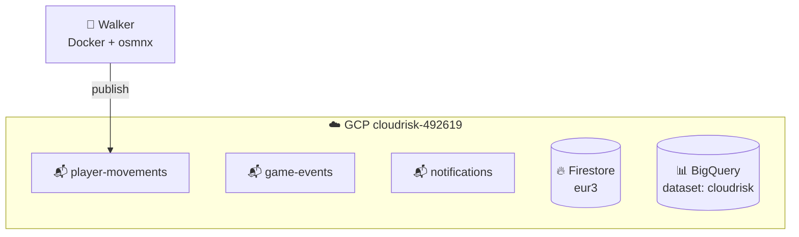

### Fase 3 — Tubo end-to-end (lo que acabamos de terminar) ✅

#### El tubo funcionando end-to-end

Conseguimos que las piezas hablen entre sí **contra la nube REAL de Google** (proyecto `cloudrisk-492619`).

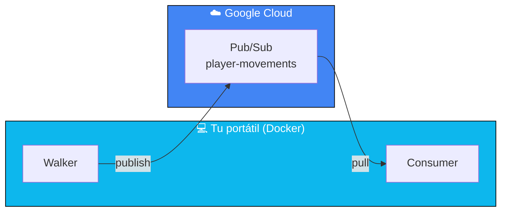

**Prueba de que funciona:** cuando ves en el terminal:

```
walker    | [walker] msg_id=17277699774563777 {...}
consumer  | [consumer] msg_id=17277699774563777 player=player_001 ...
```

Ese `msg_id` idéntico = el mismo mensaje viajó del walker → nube real de Google → consumer. **Esto es el "tubo" funcionando.** 🎉

---

### Fase 4 — Consumer con lógica de negocio ❌ descartada
Originalmente iba a ampliar el consumer para escribir en Firestore + BigQuery. **Se descartó** porque **Noelia + Martha** asumieron esa parte con un pipeline de Dataflow/Beam que hace la lógica del juego (multiplicadores por calidad del aire, penalización por clima) y escribe directamente a las dos bases de datos. Mi `consumer/` se queda como herramienta de debug.

### Fase 5 — Backend API (FastAPI con arquitectura en capas) ✅

He creado un servicio REST en `backend/` con **arquitectura por capas**, cada archivo con una sola responsabilidad.

```
backend/cloudrisk_api/
├── main.py            👔 dueño   - monta la app y registra los endpoints
├── config.py          ⚙️ manager - lee env vars con pydantic_settings
├── endpoints/         🍽️ camareros - reciben HTTP, validan, llaman a la BD
│   ├── estado.py      (GET /state/...)
│   └── acciones.py    (POST /actions/place)
└── database/          👨‍🍳 cocineros - hablan con Firestore y BigQuery
    ├── firestore_db.py
    └── bigquery_db.py
```

**Por qué importa:** si mañana cambiamos la BD, solo se toca un archivo de `database/`; los endpoints no se enteran. Tests más fáciles. Estructura estándar de la industria.

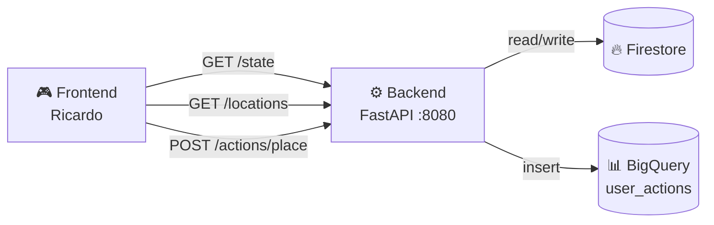

**Endpoints:**
- `GET /health` — probe de Cloud Run.
- `GET /state/{player_id}` — lee `user_balance/{player_id}` de Firestore.
- `GET /locations` — lista `location_balance` entera.
- `POST /actions/place` — transacción atómica: valida ejércitos, descuenta del jugador, suma a la zona, e inserta fila en BigQuery `user_actions`.

**Para probarlo:** `docker compose up --build` y luego `bash CICD/probar_api.sh`. Swagger UI en `http://localhost:8080/docs`.

### Fase 7 — Deploy a Cloud Run ✅ preparado

Script `CICD/desplegar_manual.sh` que:
1. Crea el repo de Artifact Registry `cloudrisk-images` (idempotente).
2. `gcloud builds submit` → sube la imagen.
3. `gcloud run deploy` del backend como servicio HTTP.
4. `gcloud run jobs create/update` del walker como **Cloud Run Job** (porque es un proceso continuo, no HTTP).

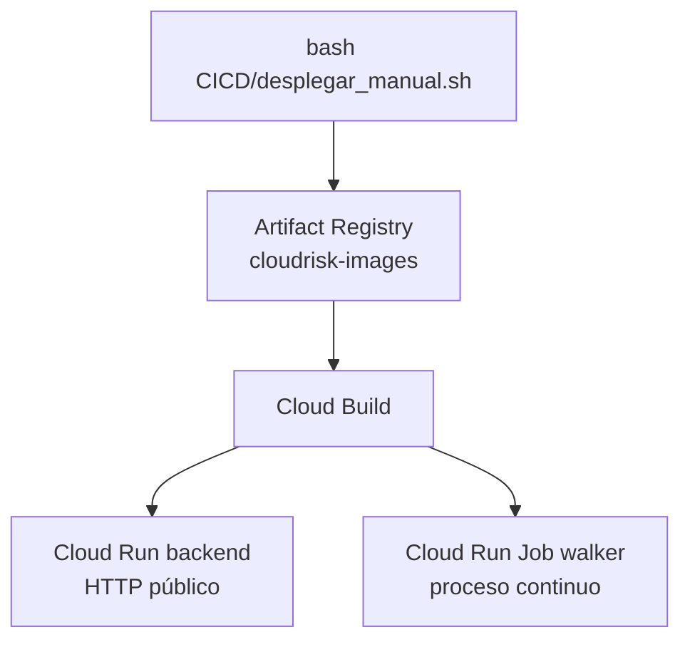

### Fase 8 — CI/CD con Cloud Build (estilo profe) ✅ preparado

Plantillas en `CICD/` siguiendo el mismo patrón del repo del profesor:
- `CICD/desplegar_backend_auto.yml` → build de la imagen y deploy a Cloud Run.
- `CICD/desplegar_walker_auto.yml` → build y deploy como Cloud Run Job.

Lanzamiento manual:
```bash
gcloud builds submit . --config=CICD/desplegar_backend_auto.yml --project=cloudrisk-492619
```

Trigger automático: con `gcloud builds triggers create github` (instrucciones en `CICD/README.md`), Cloud Build observa el repo y lanza el build cada vez que hay un push a `main` que toque las carpetas relevantes.

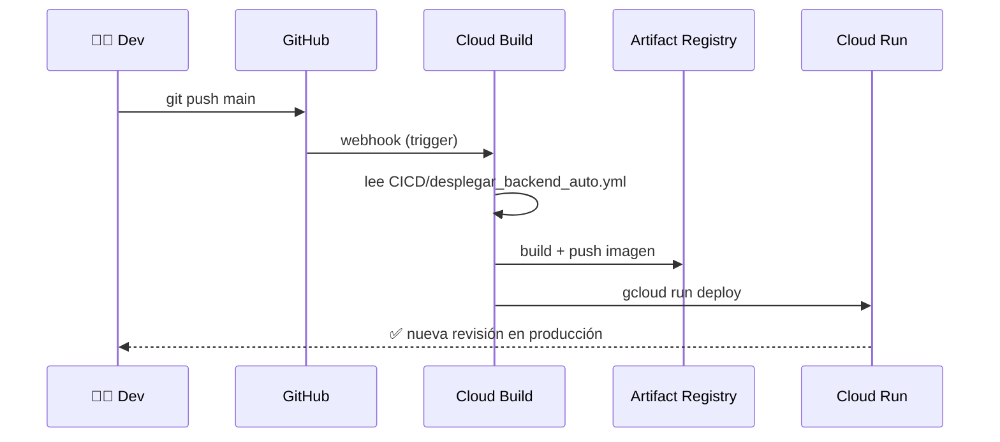

**Por qué Cloud Build y no GitHub Actions:** mismo enfoque que el profe. Todo dentro de GCP, sin Workload Identity Federation, logs en el mismo sitio que el resto del proyecto.

---

## 📁 Archivos que creamos o modificamos

| Archivo | Qué es | Para qué sirve |
|---|---|---|
| `.env` / `.env.example` | Variables de entorno | Configuración personal, ADC_PATH por persona |
| `.gitignore` | Lista negra de Git | Evita subir credenciales y basura |
| `docker-compose.yml` | Director de orquesta | Levanta walker + consumer + backend |
| `data_generator/` | Walker dockerizado | Publica pasos a Pub/Sub |
| `consumer/` | Consumer PULL | Solo debug, imprime mensajes crudos |
| `backend/cloudrisk_api/main.py` | App FastAPI | Monta endpoints, expone Swagger |
| `backend/cloudrisk_api/config.py` | Settings | pydantic_settings |
| `backend/cloudrisk_api/endpoints/` | Camareros HTTP | estado.py, acciones.py |
| `backend/cloudrisk_api/database/` | Cocineros BD | firestore_db.py, bigquery_db.py |
| `backend/Dockerfile` | Receta del backend | uvicorn en :8080 |
| `backend/requirements.txt` | Deps del backend | fastapi, pydantic-settings, firestore, bigquery |
| `CICD/crear_tablas_bigquery.sh` | Crear tabla `user_actions` | Idempotente, corre una vez |
| `CICD/probar_api.sh` | Curls de prueba | Probar el backend sin frontend |
| `CICD/desplegar_manual.sh` | Deploy manual | Build + deploy backend y walker |
| `CICD/desplegar_backend_auto.yml` | Cloud Build backend | Estilo profe |
| `CICD/desplegar_walker_auto.yml` | Cloud Build walker | Estilo profe |
| `README.md` | Manual del proyecto | Onboarding |
| `docs/EXPLICACION.md` | Este archivo | Walkthrough visual |
| `docs/REPARTO_EQUIPO.md` | Quién hace qué | Estado vivo del equipo |
| `docs/RESUMEN_EQUIPO.md` | Update en 1ª persona | Mensaje al equipo |

---

## 🔐 Cómo funcionan las credenciales (ADC)

**Problema:** ¿cómo damos acceso a Google Cloud desde un contenedor Docker, sin meter contraseñas en el código?

**Solución: Application Default Credentials (ADC)**

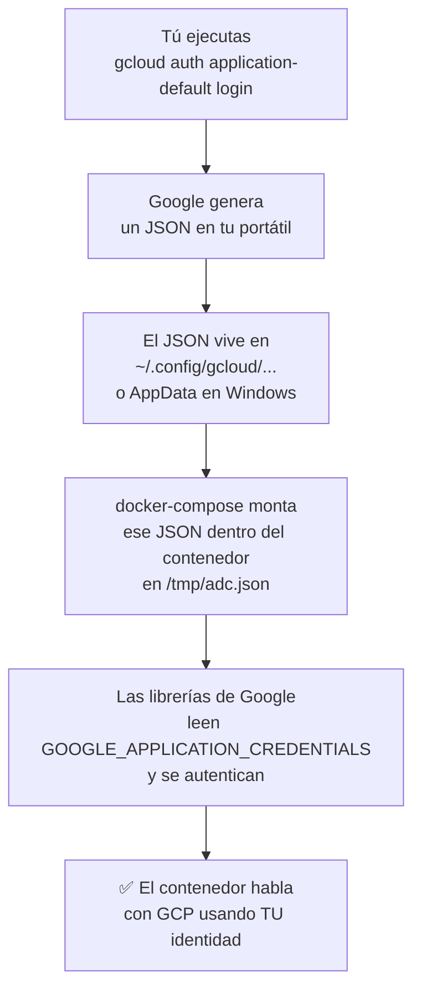

**La línea mágica** del `docker-compose.yml`:

```yaml
volumes:
  - ${ADC_PATH}:/tmp/adc.json:ro
```

| Parte | Significado |
|---|---|
| `${ADC_PATH}` | Path al JSON en TU portátil (definido en `.env`) |
| `/tmp/adc.json` | Dónde aparecerá dentro del contenedor |
| `ro` | Read-only, el contenedor no puede modificarlo |

**Por qué esto mola:**
- 🔒 Nadie comparte claves.
- 👥 Cada compañero usa su propia cuenta Google.
- 🚫 Si alguien se va del equipo, le quitas el IAM y listo.

---

## 👥 Onboarding de un compañero nuevo

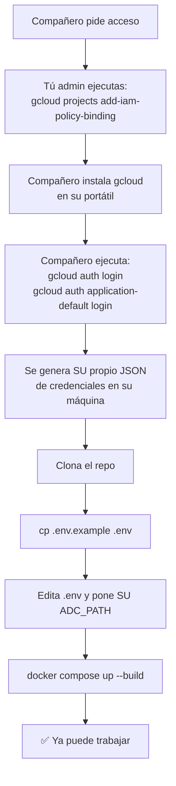

---

## 🗺 Mapa de progreso del proyecto

```mermaid
gantt
    title CloudRISK - Plan de fases
    dateFormat X
    axisFormat %s

    section Hecho
    Fase 1 - Setup GCP           :done, f1, 0, 1
    Fase 2 - Walker + topics     :done, f2, 1, 2
    Fase 3 - Tubo end-to-end     :done, f3, 2, 3

    section Siguiente
    Fase 4 - Consumer con BQ+FS  :active, f4, 3, 4
    Fase 5 - Backend API         :f5, 4, 5
    Fase 6 - Frontend (Ricardo)  :f6, 5, 6

    section Deploy
    Fase 7 - Cloud Run           :f7, 6, 7
    Fase 8 - CI/CD               :f8, 7, 8
    Fase 9 - Weather/Air (Alvaro):f9, 8, 9
```

### Leyenda del estado actual

| Componente | Estado | Responsable |
|---|---|---|
| Walker | ✅ Funcionando | Yo |
| Pub/Sub + Firestore + BigQuery | ✅ Listo | Yo |
| Consumer (debug, PULL) | ✅ Funcionando | Yo |
| Pipeline Dataflow (lógica del juego → FS + BQ) | 🟢 Listo en local | Noelia + Martha |
| Backend API (FastAPI) | ✅ Listo | Yo |
| Deploy Cloud Run (scripts + workflow) | ✅ Preparado | Yo |
| CI/CD GitHub Actions | ✅ Preparado | Yo |
| Frontend | 👷 En curso | Ricardo |
| API Weather | 👷 En curso | Álvaro |
| API Air quality | 👷 En curso | Álvaro |

---

## 🎬 Resumen en 3 frases

1. **Hemos montado la tubería** que lleva datos del walker simulado hasta Google Cloud, y hemos visto los mensajes llegar en tiempo real.
2. **Hemos preparado el proyecto para el equipo**: cualquier compañero puede clonar, autenticarse con su cuenta, y arrancar todo con `docker compose up`.
3. **Hemos documentado todo** para no tener que explicarlo 5 veces en persona.

El siguiente paso es **Fase 4**: que el consumer, en vez de solo imprimir los mensajes, los guarde en Firestore (estado) y BigQuery (histórico).

---

## 📚 Glosario rápido

| Término | Qué significa en plan humano |
|---|---|
| **GCP** | Google Cloud Platform, la nube de Google |
| **Pub/Sub** | Servicio de mensajería tipo buzón |
| **Topic** | Buzón concreto dentro de Pub/Sub (ej: `player-movements`) |
| **Subscription** | Suscripción a un topic para leer sus mensajes |
| **Firestore** | Base de datos NoSQL (estado actual) |
| **BigQuery** | Almacén analítico (histórico, para queries) |
| **Cloud Run** | Servicio para ejecutar contenedores sin gestionar servidores |
| **ADC** | Application Default Credentials, cómo te autenticas sin meter claves en el código |
| **IAM** | Identity and Access Management, quién puede hacer qué en GCP |
| **Docker Compose** | Herramienta para levantar varios contenedores con un solo comando |
| **Bind mount** | Montar un archivo de tu PC dentro de un contenedor |
| **PULL vs PUSH** | ¿El consumer va a buscar mensajes (PULL) o se los mandan (PUSH)? |
