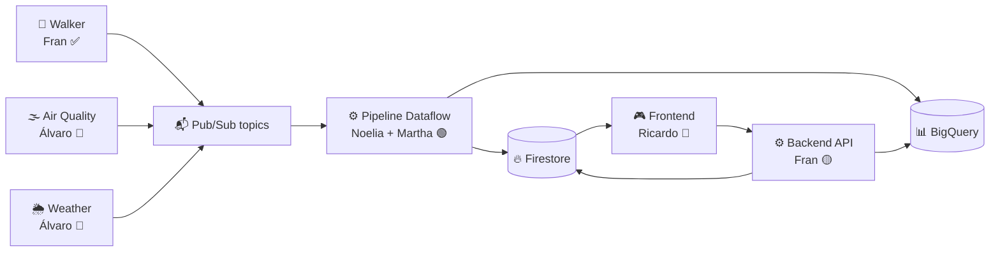

# 👥 Reparto del equipo — CloudRISK

Documento vivo con quién hace qué. Se actualiza cada vez que cambia el scope de alguien.

---

## 🧩 Piezas del sistema y responsables

| # | Pieza | Responsable | Estado | Notas |
|---|---|---|---|---|
| 1 | Walker (generador de pasos) | **Fran** | ✅ Hecho | Contenedor `data_generator/`, publica a `player-movements` |
| 2 | Infra GCP (proyecto, topics, Firestore, BigQuery) | **Fran** | ✅ Hecho | Proyecto `cloudrisk-492619` |
| 3 | Docker Compose + onboarding del equipo | **Fran** | ✅ Hecho | ADC personal por persona, sin claves compartidas |
| 4 | API Air Quality (ingesta) | **Álvaro** | 👷 En curso | Contenedor en `weather_airq/`, publicará a topic `air-quality` |
| 5 | API Weather (ingesta) | **Álvaro** | 👷 En curso | Contenedor en `weather_airq/`, publicará a topic `weather` |
| 6 | Pipeline Dataflow / Apache Beam (lógica del juego) | **Noelia + Martha** | 🟢 Listo en local | Lee Pub/Sub, aplica multiplicadores aire/clima, escribe a Firestore + BigQuery. Esperando acceso GCP |
| 7 | Backend API (acciones de usuario) | **Fran** | ✅ Hecho | FastAPI **con arquitectura en capas** (`cloudrisk_api/endpoints/` + `cloudrisk_api/database/` + `config.py`). Endpoints en `/api/v1/...` |
| 8 | Frontend (mapa + panel) | **Ricardo** | 👷 En curso | React/Streamlit, consume el backend de Fran |
| 9 | Deploy a Cloud Run (scripts + Cloud Run Job walker) | **Fran** | ✅ Preparado | `CICD/desplegar_manual.sh`, idempotente |
| 10 | CI/CD Cloud Build (estilo profe) | **Fran** | ✅ Preparado | `CICD/desplegar_backend_auto.yml` y `CICD/desplegar_walker_auto.yml`. Trigger automático con `gcloud builds triggers create github` |

---

## 🔗 Dependencias entre tareas

### Bloqueos actuales
- **Noelia + Martha** bloqueadas → esperando acceso IAM al proyecto GCP.
- **Noelia + Martha** dependen parcialmente de **Álvaro** → necesitan los mensajes de aire/clima para que los multiplicadores funcionen con datos reales.
- **Ricardo** puede empezar a maquetar con mocks; dependerá del **backend de Fran** (Fase 5) para conectar de verdad.

---

## 📬 Contratos entre piezas (lo que cada uno expone al resto)

### Fran → Álvaro
- Proyecto GCP `cloudrisk-492619` accesible vía IAM.
- Topics `air-quality` y `weather` que Álvaro creará y publicará.
- `docker-compose.yml` con huecos comentados para sus contenedores en `weather_airq/`.

### Fran → Noelia + Martha
- Proyecto GCP con acceso IAM.
- Topic `player-movements` publicando en tiempo real (ya funciona).
- Firestore Native en `eur3` y dataset BigQuery `cloudrisk` ya creados.

### Fran → Ricardo
- Backend API **operativo en local** (`docker compose up --build`) con los endpoints:
  - `GET /health`
  - `GET /state/{player_id}` → `{armies, total_steps, updated_at}`
  - `GET /locations` → lista de zonas con ejércitos actuales
  - `POST /actions/place` → body `{player_id, location_id, armies}`
- Swagger UI interactivo en `http://localhost:8080/docs`.
- Cuando se despliegue a Cloud Run, pasaré la URL pública.

### Álvaro → Noelia + Martha
- Formato de los mensajes de aire y clima (acordar campos).
- Escala del multiplicador de aire (0.6–1.5) y definición de "clima extremo" (−0.2).

### Noelia + Martha → Ricardo
- Firestore actualizado en tiempo real con el estado del juego.
- Esquema de colecciones (`user_balance`, `location_balance`) acordado con Fran.

---

## 🔄 Cambios de scope recientes

- **Fran** iba a implementar la escritura Firestore + BigQuery desde su `consumer/` en Fase 4. **Ya no**, porque el pipeline de Dataflow de Noelia cubre esa parte. Fran libera tiempo para centrarse en el **Backend API** (Fase 5).
- El `consumer/` de Fran se mantiene en el repo como herramienta de **debug** para ver los mensajes crudos del topic sin lógica de juego.

---

## 📅 Próximos hitos

| Fecha aprox. | Hito | Responsable |
|---|---|---|
| Esta semana | Dar acceso IAM a Noelia y Martha | Fran |
| Esta semana | APIs Weather + Air Quality publicando | Álvaro |
| Esta semana | Pipeline Dataflow conectado al Pub/Sub real | Noelia + Martha |
| Esta semana | Frontend consumiendo backend de Fran | Ricardo |
| Semana siguiente | Configurar Workload Identity Federation (WIF) para CI/CD | Fran |
| Semana siguiente | Primer deploy real a Cloud Run (`bash CICD/desplegar_manual.sh`) | Fran |
| +2 semanas | CI/CD activo desde `git push` | Fran |

---

*Última actualización: mantener esta tabla al día cuando cambie el reparto.*
